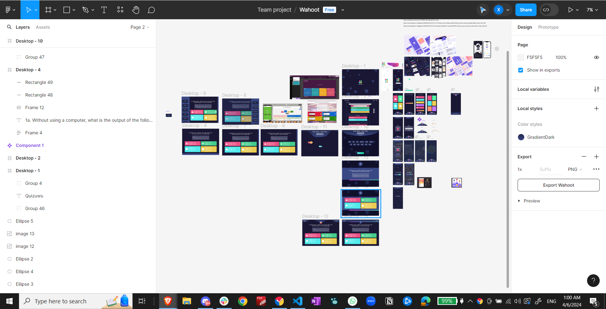
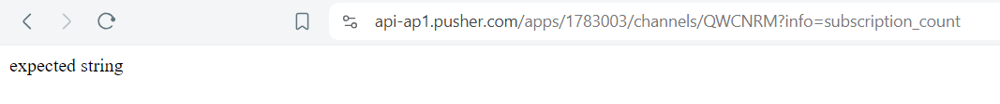

## Day 1

* Created Figma Designs

## Day 2
* Had some issues with Pusher - couldn't find a lot of recent documentation about using it client side with Nextjs - convension used in previous project was out of date :/
* Also ran into issues with TRPC - totally forgot how it works and had no idea how to make it work with the app router
  * turns out T3 already handled everything and I just had a typo (importing from "~/trpc/server" instead of "~/trpc/react" when using inside a client component)
* Managed to get creating and joining rooms working with players triggering a "player-joined" event when joining
* Deciding not to use "player-joined" events to track players in the lobby
  * Decided to store some state in URL for better persistence - but if the following happened
      1. host created game
      2. players joined game
      3. players names show up in host lobby
      4. host reloads page
      5. players names will no longer show up and there's no way to get previously joined player's names unless we do a ping back and forth which would take quite a lot from the message quota and can be abused by hosts refreshing a bunch of times; or we could persist a list of players joined in localstorage/indexdb but if any players join while host is disconnected, we can't get those players' names back either :<
  * Should just use Pusher's HTTP API for subscription counting for now
* Spent another like 2 hours realising that the HTTP API isn't as easy as I thought - I didn't realised that they required authentication with signatures for ALL requests and just kept getting `expected string` as an error:
  * 
  * Eventually figured it out though :))